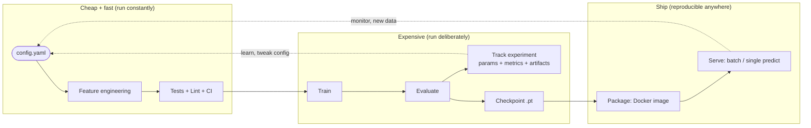
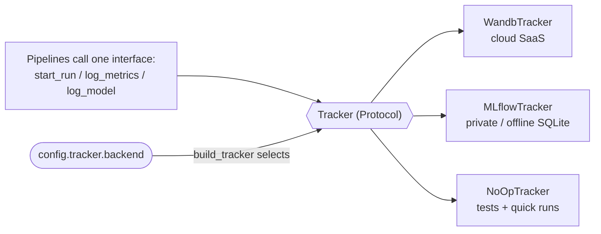

# 🩻 vqa-chest — End-to-End MLOps, Explained

A teaching document. It uses **this repo** as the worked example, but the goal is to give you a **mental model you can reuse on every future project**. Read it top-to-bottom once; keep the checklist at the end for next time.

---

## 0. TL;DR (the one-paragraph version)

You didn't just train a model — you built a **system that turns raw data into a reproducible, testable, deployable prediction service**, where you can **swap infrastructure (tracking backend, database, device) by editing config, never code**. That is the difference between "a notebook that got 60% accuracy" and "an ML product." Every stage is a `run(config)` function behind a CLI, dependencies are locked, the same feature code runs at train and inference (so predictions can't drift), experiments are tracked **privately/offline**, tests + CI prove it works cheaply before you spend money on a full train, and Docker packages the whole thing so it runs identically on your laptop, in CI, or on a Mayo Clinic server.

---

## 1. The MLOps mental model (memorize this)

MLOps = **DevOps applied to ML**, plus two extra hard problems DevOps doesn't have: **data** and **models** change behavior even when code doesn't.

The spine to remember — I call it **"Config in, artifacts out, proof at every gate":**



Seven principles that fall out of this diagram (they are the "why" behind almost every file in your repo):

1. **Config in, artifacts out.** A run is a pure-ish function: `config → (checkpoint, metrics, predictions)`.
2. **Every stage is a callable step**, not a cell you scroll to. Steps compose.
3. **Swap infrastructure via config, never code** (tracker, DB URI, device).
4. **Same feature code at train and inference** → no train/serve skew.
5. **Lock everything** (dependencies + random seed) → reproducible.
6. **Prove it cheaply before it's expensive** (fast tests + CI gate the slow GPU train).
7. **Package once, run anywhere** (Docker), so "works on my machine" is never a sentence you say.

---

## 2. The lifecycle, mapped to *your* files

This is why the project is genuinely **end-to-end** — every stage of the lifecycle physically exists in the repo, not just the "train a model" part.

| Lifecycle stage | Where it lives | What it does |
|---|---|---|
| **Problem framing** | `README.md` | Binary yes/no VQA on chest X-rays; leakage risk flagged up front |
| **Data ingestion** | `src/pipelines/training_pipeline.py` (`load_dataset`) | Streams `flaviagiammarino/vqa-rad` from HF Hub; no raw data in repo |
| **Feature engineering** | `src/pipelines/feature_eng_pipeline.py` | Image transforms + frozen DistilBERT CLS embedding |
| **Dataset abstraction** | `src/data.py` | `VQARADBinaryDataset` wraps HF split into a PyTorch `Dataset` |
| **Model** | `src/models/model.py`, `baseline.py` | CNN image branch + text embedding → fused MLP head |
| **Training** | `src/pipelines/training_pipeline.py` | Seeded loop, optimizer, per-epoch metrics, checkpoint |
| **Evaluation** | `src/pipelines/evaluate_pipeline.py` | Accuracy, AUC-ROC, avg precision, confusion matrix, ROC curve |
| **Experiment tracking** | `src/tracking.py` | Swappable W&B / MLflow / no-op behind one interface |
| **Inference / serving** | `src/pipelines/inference_pipeline.py` | Batch CSV **or** single (image, question) |
| **CLI surface** | `entrypoint/train.py`, `entrypoint/inference.py` + `pyproject.toml [project.scripts]` | `uv run train`, `uv run predict` |
| **Config** | `config/local.yaml` | All hyperparameters + backend choice in one place |
| **Reproducibility** | `uv.lock`, `src/utils.py` (`set_seed`) | Exact deps + deterministic seed |
| **Quality gates** | `tests/`, `.github/workflows/ci.yml` | Fast tests + ruff lint/format on every push/PR |
| **Packaging** | `Dockerfile` | Identical environment for CI, batch, on-prem |

**"Full lifecycle" means the loop closes:** tracking feeds back into config decisions (tune, re-run), and serving/monitoring feeds new data back into the next iteration. A model that only goes forward once is a demo; a loop is a lifecycle.

---

## 3. WHY WHY WHY — every design decision, and the problem it kills

For each pattern: **the trap it avoids** (this is what makes it stick).

### 3.1 Config-driven runs (`config/local.yaml`)
- **Trap avoided:** hyperparameters and environment details hard-coded across 10 notebook cells, so "which settings produced this result?" is unanswerable.
- **Why it matters:** the YAML *is* the experiment. Change `lr`, `epochs`, `backend`, or `tracking_uri` and rerun — the code is untouched, so results are attributable and diffable in git. You'll notice `device: "cuda"` but the code does `config["device"] if torch.cuda.is_available() else "cpu"` — the **same config runs on your GPU box, a CPU laptop, and the CPU Docker image**.

### 3.2 Swappable experiment tracking (`src/tracking.py`) — the crown jewel
This is the **Strategy pattern / dependency inversion**, and it's the most reusable idea in the repo.



- **Trap avoided:** vendor lock-in and code changes every time infra changes. Normally, switching from W&B to MLflow means editing every training/eval file.
- **How yours does it:** pipelines only ever call the six methods on the `Tracker` `Protocol` (`start_run`, `log_params`, `log_metrics`, `log_figure`, `log_model`, `finish`). `build_tracker(config)` returns the right implementation. Swapping backends = **one line of YAML**.
- **Two subtle-but-pro details worth internalizing:**
  - **Lazy imports** (`import wandb` / `import mlflow` *inside* the class): you only need the dependency for the backend you actually use.
  - **`NoOpTracker`**: lets tests and quick runs execute the *real* pipeline with tracking turned into a no-op — no network, no accounts. This is why your tests are fast and offline.

### 3.3 Pipeline separation (`src/pipelines/*`)
- **Trap avoided:** one 800-line `main()` where you can't test evaluation without running training.
- **Why:** each stage is a `run(...)` function. Training *calls* evaluate at the end; you can also call evaluate or inference standalone. Small, composable, testable.

### 3.4 Train/serve skew prevention (`inference_pipeline.py`)
- **Trap avoided:** the #1 silent killer in production ML — training preprocesses data one way, serving does it slightly differently, and accuracy quietly rots.
- **Why yours is safe:** inference imports the **exact same** `build_text_encoder`, `build_img_transform`, and `encode_question` used in training. There is no second copy of the preprocessing logic to drift.

### 3.5 CLI entrypoints (`pyproject.toml [project.scripts]`)
- **Trap avoided:** "run cell 1, then 4, then scroll down and run 7." Not automatable, not reproducible.
- **Why:** `train = "entrypoint.train:main"` gives you `uv run train --config ...`. Anything with a CLI can be scripted, Dockerized, scheduled, and CI-tested.

### 3.6 Reproducibility (`uv.lock` + `set_seed`)
- **Trap avoided:** "it worked last month" — then a transitive dependency upgraded and broke silently.
- **Why:** `uv sync --frozen` installs the **exact** locked versions; `set_seed(config["seed"])` makes runs deterministic. Same inputs → same outputs. This is non-negotiable in regulated settings.

### 3.7 Tests + CI (`tests/`, `.github/workflows/ci.yml`)
- **Trap avoided:** discovering a bug *after* a 3-hour GPU train, or merging code that doesn't even import.
- **Why:** the `slow` marker splits tests. `pytest -m "not slow"` runs 10 tests in ~10s with zero downloads (thanks to `NoOpTracker`), and CI runs them + `ruff` on every push/PR to `main`. **Cheap proof gates expensive work.**

---

## 4. Why Docker (specifically)

Docker answers one question: **"will this run somewhere that isn't your laptop?"**

- **Reproducible environment, not just reproducible code.** `uv.lock` pins Python packages, but not the OS, system libraries, or Python itself. The `Dockerfile` pins all of it (`python:3.12-slim` + the exact `uv` binary). The container that passes CI is byte-for-byte the container that runs on the Mayo server.
- **Kills "works on my machine."** Your `docker run --rm vqa-chest uv run pytest -m "not slow"` just passed **inside Linux** — proving the image is self-contained, not dependent on anything in your Windows setup.
- **Layer caching = fast rebuilds.** Note the deliberate ordering in your `Dockerfile`: copy `pyproject.toml` + `uv.lock` and install deps **first**, then copy source. Editing a `.py` file doesn't reinstall PyTorch — only the cheap final layers rebuild.
- **Deployment substrate.** CI runners, batch jobs, Kubernetes, and cloud services all speak "container." A Docker image is the universal unit of deployment.
- **A teaching nuance in your file:** it's a **CPU** image (portable, small-ish, CI-friendly). The comments correctly note that for GPU training you swap the base to an NVIDIA CUDA image and install the CUDA build of torch. Same pattern, different base — that's the flexibility you want.

> Reality check you just lived: Docker wouldn't start because its **WSL2 kernel was stale**. `wsl --update` (elevated) fixed it. That's a normal MLOps day — the *tooling* around the model is often where time goes, which is exactly why packaging it once is worth it.

---

## 5. Why MLflow (and why *private* MLflow beats W&B here)

Both MLflow and W&B are experiment trackers: they record **params, metrics, and artifacts** so runs are comparable and auditable. Your repo supports both. So why default to MLflow?

- **Privacy / data residency.** With an empty `tracking_uri`, `MLflowTracker` logs to a **local SQLite file (`sqlite:///mlflow.db`) with zero network calls**. Nothing leaves the machine. W&B is cloud SaaS by default — data leaves your environment. For chest X-rays / clinical data, "offline by default" is the whole ballgame.
- **Self-hostable and scalable *without changing your code*.** The `tracking_uri` is the single knob:
  - `""` → local private SQLite (your laptop, offline)
  - `"postgresql://..."` → your team's on-prem database
  - `"http://mlflow.internal:5000"` → a self-hosted tracking server
  The **shape** (metadata store + artifact store) is identical from laptop to on-prem cluster.
- **Open source, no vendor lock-in.** You own the data and the server.
- **When W&B is the right call:** public datasets, cloud-native teams, slick collaborative dashboards. Your `tracker.backend: wandb` switch is there for exactly those cases — you kept the option open.

> One discipline the code encodes in comments and docstrings: **never log PHI** into params, metric names, or artifact filenames — regardless of backend. Tracking systems are searchable and replicated; treat them as public.

**Why an experiment tracker at all?** Because "I think the run with lr=0.001 was better" is not engineering. A tracker turns model development into a **queryable, comparable, reproducible record** — which is also your audit trail.

---

## 6. Why this is a *true* end-to-end project

A useful litmus test. A demo has the first row; an end-to-end system has all of them:

| Question | Demo / notebook | This repo |
|---|---|---|
| Can someone else reproduce your result? | "Maybe, if the data + versions line up" | `uv sync --frozen` + seed + config → yes |
| Can you change the tracker/DB without touching code? | No | One line of YAML |
| Can it run off your machine? | No | Docker image, verified in Linux |
| Do you catch breakage before a long train? | No | Fast tests + CI gate |
| Can it serve predictions, not just train? | Rarely | Batch **and** single-item inference |
| Is preprocessing guaranteed identical train vs serve? | Usually not | Shared feature-eng module |
| Is it honest about risk? | Hides it | Leakage (202 shared hashes) flagged in README |

That last row matters: maturity is **surfacing** the train/test image-leakage risk up front, not discovering it after deployment. Reporting ~60% honest test accuracy with a known-leakage caveat beats a shiny inflated number.

---

## 7. The tech stack — minimum vs nice-to-have

Think in **tiers**. The minimum tier is what makes something legitimately "end-to-end MLOps." Everything above is scaling and hardening.

### Minimum (must-have to call it end-to-end) — you have all of these
| Concern | Tool here | Non-negotiable because |
|---|---|---|
| Version control | Git | Nothing works without it |
| Dependency locking | `uv` + `uv.lock` | Reproducibility |
| Config-driven runs | YAML + `build_tracker` | Attributable experiments |
| Modular pipeline code | `src/pipelines/*` | Testable, composable |
| Model + inference path | `training_` / `inference_pipeline` | A model you can't serve isn't done |
| Tests | `pytest` + `slow` marker | Cheap proof |
| CI | GitHub Actions | Automated gate |
| Experiment tracking | MLflow / W&B | The record/audit trail |
| Containerization | Docker | Runs anywhere |

### Nice-to-have (add when scale / risk / team size demands it)
- **Model registry & versioning** (MLflow Model Registry) — promote `staging → production`, roll back.
- **Data/artifact versioning** (DVC, LakeFS) — version the *dataset*, not just code.
- **Workflow orchestration** (Airflow, Prefect, Dagster, Kubeflow) — schedule/retrain, DAGs with retries.
- **Online serving API** (FastAPI, TorchServe, BentoML) — real-time endpoint vs your current batch/CLI.
- **Monitoring & drift detection** (Evidently, Prometheus/Grafana) — catch accuracy rot and input drift in prod.
- **Feature store** (Feast) — only once features are shared across many models.
- **Orchestrated deployment** (Kubernetes, cloud ML platforms) — scale-out and rollouts.
- **Governance** (model cards, data sheets, lineage) — mandatory in clinical/regulated settings.
- **Domain fix flagged in your README:** image-disjoint splits to kill the 202-hash leakage; unfreeze/token-level DistilBERT for accuracy.

**Rule of thumb:** don't add a tier until a real pain forces it. A feature store for one model is resume-driven development, not engineering.

---

## 8. How this helps Mayo Clinic (the healthcare angle)

Mayo's constraints are **privacy, reproducibility, and auditability** — and this architecture is shaped for exactly those:

- **Data never has to leave the building.** Private MLflow (`sqlite:///mlflow.db`, or on-prem Postgres + object store) means experiment tracking with **zero external calls** — critical for PHI and HIPAA posture.
- **Reproducibility = auditability.** Locked deps + seed + config-as-record means any past result can be reconstructed and explained to a regulator or reviewer. "Which model, trained on what, with which settings, produced this prediction?" has a concrete answer.
- **PHI discipline is baked in.** The code and docs explicitly warn against logging PHI into params/metrics/filenames — a habit that prevents the most common accidental leak.
- **On-prem friendly.** A CPU Docker image runs on internal infrastructure with no GPU and no cloud dependency; the CUDA base swap is documented for when GPUs are available.
- **Honest risk surfacing.** Flagging train/test leakage *before* clinical claims is the mindset clinical ML demands — models influence care, so overstated metrics are a safety issue, not just a bug.
- **Config-gated data governance.** Pointing `dataset` / `tracking_uri` at approved internal sources (not public Hubs) is a one-line, reviewable change — easy to enforce in code review.

In short: it's a template for **doing ML on sensitive data without the data ever leaving a controlled environment**, while keeping a full audit trail.

---

## 9. How this helps *you* on future projects

You now own a **transferable blueprint**, not a one-off. On your next project, you don't start from a blank notebook — you start from these patterns:

1. **Reuse the spine verbatim:** `config.yaml` → `src/pipelines/{feature,train,eval,infer}` → CLI entrypoints → `Dockerfile` → CI. Only the model and data code change.
2. **Copy `tracking.py` directly.** The `Tracker` Protocol + `build_tracker` pattern is domain-agnostic; it works for any ML project.
3. **Adopt the `slow` marker + `NoOpTracker` habit** so your tests stay fast and offline from day one.
4. **Lead with the config.** Ask "what would I want to change without touching code?" and put exactly that in YAML.
5. **Interview / portfolio leverage:** you can now speak concretely about train/serve skew, vendor abstraction, layer caching, reproducibility, and private tracking — with a repo that demonstrates each. That's a senior-level conversation, not a bootcamp one.

### Your reusable "new project" checklist
```text
[ ] git init + .gitignore (data, checkpoints, mlflow.db, mlartifacts)
[ ] uv init; pin Python; commit uv.lock
[ ] config/local.yaml: hyperparams + tracker block + paths + seed + device
[ ] src/pipelines: feature_eng, training, evaluate, inference (each a run(...))
[ ] src/tracking.py: Tracker Protocol + wandb/mlflow/none + build_tracker
[ ] Reuse SAME feature code in training and inference (no skew)
[ ] set_seed everywhere randomness enters
[ ] entrypoint/*.py + [project.scripts] for CLI
[ ] tests/ with a 'slow' marker; NoOpTracker for offline tests
[ ] .github/workflows/ci.yml: ruff + fast tests on push/PR
[ ] Dockerfile: lockfiles first (cache), source second; CPU base + GPU note
[ ] README: problem, results, KNOWN RISKS, usage
[ ] Never log PHI/secrets into tracking
```

---

## 10. Mini-glossary (say these correctly)

- **MLOps** — engineering practices to build, deploy, and maintain ML *systems* reliably (DevOps + data + models).
- **Train/serve skew** — training and inference preprocess data differently, silently degrading production accuracy.
- **Experiment tracking** — recording params/metrics/artifacts per run for comparison, reproducibility, and audit.
- **Model registry** — versioned store of trained models with lifecycle stages (staging/production).
- **Data drift** — production input distribution moves away from training data; accuracy decays even with unchanged code.
- **Reproducibility** — same inputs (code + data + deps + seed) reliably yield the same outputs.
- **Layer caching (Docker)** — unchanged early build steps are reused, so only what changed rebuilds.
- **Strategy pattern / dependency inversion** — depend on an interface (`Tracker`), pick the implementation at runtime (via config).

---

*Companion to `README.md`. The README is "what it is and how to run it"; this is "why it's built this way and how to think about it."*
